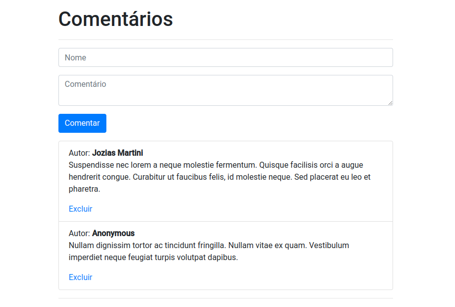

# commentr
A system for publishing and deleting comments.

### Preview

### Technologies
- [HTML](https://developer.mozilla.org/pt-BR/docs/Web/HTML)
- [CSS](https://sass-lang.com/)
- [Vue 2](https://vuejs.org/)
- [Bootstrap](https://getbootstrap.com/docs/4.0/)
- [ESLint](https://eslint.org/)

### Running
- Install dependencies with `npm install`
- Serve for development with `npm run serve`
- Compile for production with `npm run build`
- Lint and fixes with `npm run lint`
